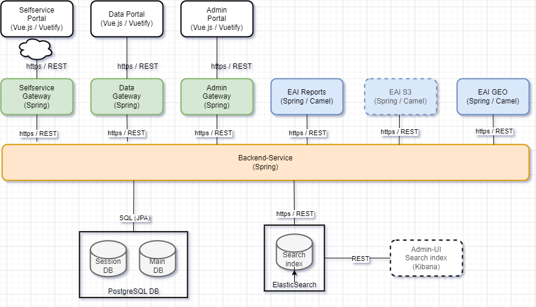
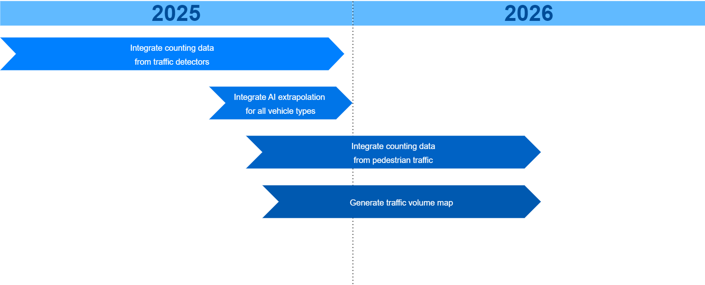

# DAVe

> Under construction

With [DAVe](https://opensource.muenchen.de/software/dave.html), traffic counts can be commissioned, recorded and graphically evaluated using various diagrams.

Technical description in the [docs](/docs/src/index.md)

### Stack
* Java 21
* Spring Boot 3
* ElasticSearch 8
* PostgreSQL
* Typescript
* Vuejs 3
* Vuetify 3
* Leaflet

### Architecture

* [Data Portal](https://github.com/it-at-m/dave-frontend)
* [Admin Portal](https://github.com/it-at-m/dave-admin-portal)
* [Selfservice Portal](https://github.com/it-at-m/dave-selfservice-portal)
* [Backend-Service](https://github.com/it-at-m/dave-backend)
* [EAI Reports](https://github.com/it-at-m/dave-eai)
* _EAI S3_ Still under construction.
* _EAI GEO_ Internal component for provisioning of traffic detector counts. Not published as Opensource.

## Roadmap

