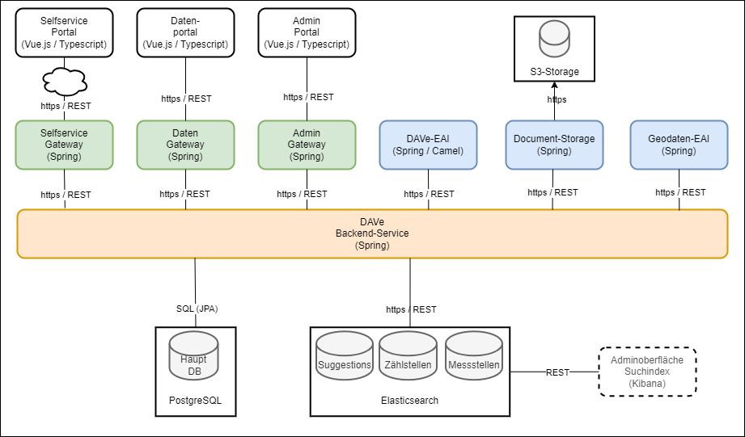
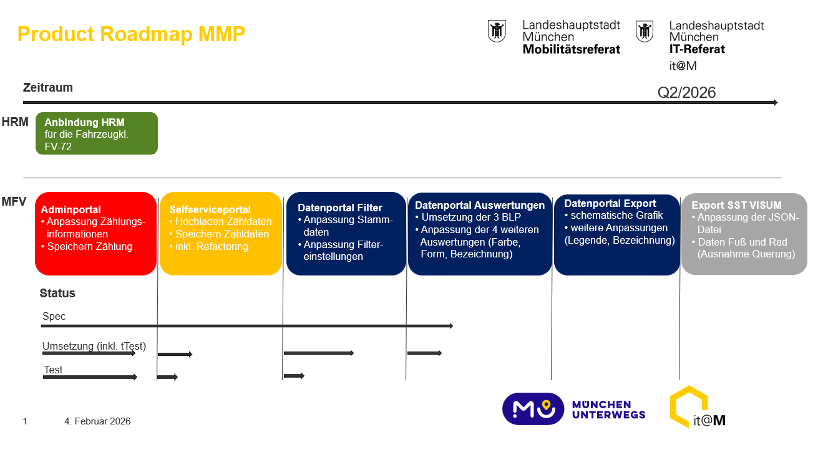

# DAVe

> Under construction

With [DAVe](https://opensource.muenchen.de/software/dave.html), traffic counts can be commissioned, recorded and graphically evaluated using various diagrams.

* User Manual: [2025_DAVe_Anwenderhandbuch_Datenportal_v1.1.pdf](/2025_DAVe_Anwenderhandbuch_Datenportal_v1.1.pdf) (german)
* Developer Manual: [/docs](/docs/src/index.md) (english)

### Stack
* Java 21
* Spring Boot 3
* ElasticSearch 8
* PostgreSQL
* Typescript
* Vuejs 3
* Vuetify 3
* Leaflet

### Architecture

* [Data Portal](https://github.com/it-at-m/dave-frontend)
* [Admin Portal](https://github.com/it-at-m/dave-admin-portal)
* [Selfservice Portal](https://github.com/it-at-m/dave-selfservice-portal)
* [Backend-Service](https://github.com/it-at-m/dave-backend)
* [EAI Reports](https://github.com/it-at-m/dave-eai)
* [Document-Storage](https://github.com/it-at-m/dave-document-storage)
* _EAI GEO_ Internal component for provisioning of traffic detector counts. Not published as Opensource.

## Roadmap

A detailed board of what opensource features and issues are currently treated can be observed under:
[DAVe working public](https://github.com/orgs/it-at-m/projects/14/views/1)
