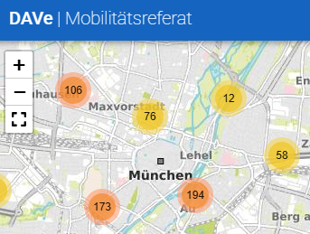

Contents
  * [Intro](#intro)
  * [Getting started](#getting-started)
  * [Persistence](#persistence)
  * [Configuration](#configuration)
  * [Deployment](#deployment)
  * [Security](#security)
  * [Test data](#test-data)
  * [Examples](#examples)
  * [CSV upload specification](#csv-upload-format-specification)

## Intro

With [DAVe](https://opensource.muenchen.de/software/dave.html), traffic counts can be commissioned, recorded and graphically evaluated using various diagrams.

You can:
* Create counting points and measuring sites
* Set up countings and commision external operators to conduct the count
* Upload counting data, validate and process them
* Analyse countings and compare them to others

DAVe consists of the following components:

* [Backend](https://github.com/it-at-m/dave-backend): Contains business logic, data management and integration.
* Three frontend portals: 
    * [Data portal](https://github.com/it-at-m/dave-frontend): To analyse the counting points and mesurement sites on a map.
    * [Admin portal](https://github.com/it-at-m/dave-admin-portal) For administrational tasks.
    * [Selfservice portal](https://github.com/it-at-m/dave-selfservice-portal): For counting point operators to upload their data records manually.
* and three EAIs (Enterprise application integration): 
    * [EAI Reports](https://github.com/it-at-m/dave-eai) (optional) Integration to deliver raw counting data to other systems.
    * [Document storage](https://github.com/it-at-m/dave-eai) (optional) Component to integrate an S3-based storage for site plans of measurement sites.
    * [Geodata EAI](https://github.com/it-at-m/dave-eai) (optional) Interface to obtain raw detector data from external systems.

Further details can be read in 
* [User manual data portal](de/DAVe_Anwenderhandbuch_Datenportal.pdf) (german)
* [System specification](./de/system-specification.md) (german)

## Getting started

For local development you can run DAVe in docker.
Please refer to [docker-compose.md](install/docker-compose.md).

But for a basic peek on what DAVe has to offer,
we provide a [docker-compose.yml](https://github.com/it-at-m/dave-backend/tree/sprint/stack/docker-compose.yml) with a profile for a sample application.
If you quickly want to try out DAVe with some sample data, follow the instructions in https://github.com/it-at-m/dave-backend/blob/sprint/stack/readme.md#dave-sample-stack.

For running and operating DAVe in kubernetes take a look at the [deployment section](#deployment).

## Persistence

The data is stored in two different databases: 

* the data relevant for the search, such as location or street names, is stored in ElasticSearch. This enables a very high-performance search with search suggestions in real time. 
* The traffic data from the counts that is not required for the search is stored in a relational database PostgreSQL.

## Configuration

For local development adapt the application.yml files in the src/main/resource folder of every application to your needs 
(e.g. [dave-backend application.yml](https://github.com/it-at-m/dave-backend/blob/sprint/src/main/resources/application.yml)).

For running the apps via helm-chart a list of usable environment variables can be found in our helm-chart repository:
[values.yaml](https://github.com/it-at-m/helm-charts/blob/95c2b1e2c0fb4046d1176bcd1d45be5ba640770f/charts/dave/values.yaml)

### Identity and access management

Identity and access management for all DAVe component are managed best with KeyCloak.
See the installation instructions in [keycloak.md](install/keycloak.md) on how to integrate it in your DAVe infrastructure.

### City districts

DAVe structures the counting districts according to city districts.
To adapt the default districts for local development the variable ‘dave.stadtbezirk-mapping-config-url’  
in the [dave-backend application.yml](https://github.com/it-at-m/dave-backend/blob/sprint/src/main/resources/application.yml) must be set.

For running the helm-chart an environment variable DAVE_STADTBEZIRKMAPPINGCONFIGURL in [values.yaml](https://github.com/it-at-m/helm-charts/blob/main/charts/dave/values.yaml) 
must be set. The mapping file must then be added to the classpath of the container via ConfigMap.

Refer to [stadtbezirke.properties](https://github.com/it-at-m/dave-backend/blob/sprint/src/main/resources/config/stadtbezirke.properties) for the file format.

If you do not use city districts or don't want their number to appear in the number of the counting point 
you have to turn off automatic number assignment via DAVE_ZAEHLSTELLE_AUTOMATICNUMBERASSIGNMENT.

### Map center

DAVe's default map center is Munich Central. This can be configured through the dave.map.center attributes 
as in [dave-backend application.yml](https://github.com/it-at-m/dave-backend/blob/sprint/src/main/resources/application.yml) for local development 
or via DAVE_TENANT_MAP_CENTER_LAT / DAVE_TENANT_MAP_CENTER_LNG variables in [values.yaml](https://github.com/it-at-m/helm-charts/blob/main/charts/dave/values.yaml) 
for running the helm-chart. 

### Map layers

The maps displayed in DAVe can be configured in the [dave-backend application.yml](https://github.com/it-at-m/dave-backend/blob/sprint/src/main/resources/application.yml) for local development.
The two variables `dave.tenant.map.base-layers` and `dave.tenant.map.overlay-layers` each contain a list of map layers.

The map layers configured in the `dave.tenant.map.base-layers` variable are the base maps. By default, the first item in the list is displayed in DAVe. Other maps can be selected in the GUI. At least one map layer must be configured for the backend to start.

The overlay layers configured in the `dave.tenant.map.overlay-layers` variable can be displayed in addition to the base maps. They can be selected in the GUI. These layers can represent features such as city districts or traffic light locations on the map.

For configuration of the helm-chart refer to the DAVE_TENANT_MAP_BASELAYERS_ and DAVE_TENANT_MAP_OVERLAYLAYERS_ variables 
in [helm-chart values.yaml](https://github.com/it-at-m/helm-charts/blob/main/charts/dave/values.yaml).

### Other DAVe specific configuration items

| Variable name                                              | Description                                                                                                                        |
|------------------------------------------------------------|------------------------------------------------------------------------------------------------------------------------------------|
| DAVE_TENANT_DATENPORTALHEADER                              | Configuration of the header of the top left corner of DAVe    |
| DAVE_ZAEHLSTELLE_LINKDOCUMENTATIONCSVFILEFORUPLOADZAEHLUNG | Configuration of the link for the csv format documentation                                                                         |

## Deployment

DAVe __should be__ installed and operated via the official [helm chart](https://artifacthub.io/packages/helm/it-at-m/dave?modal=install).

For further instructions see [kubernetes.md](install/kubernetes.md).

## Security

Usually, all repositories belonging to DAVe are configured with [Renovate](https://www.mend.io/renovate/)
to keep dependencies and security up to date.

However, we are currently in a major implementation phase in which we are manually installing version upgrades and security patches
so that changes can be approved by our test management team.

Renovate is therefore temporarily disabled while in the project phase.

Once the work is complete, we will reactivate Renovate.

## Test data

We provide a set of test data files for each counting type to use for uploading to the selfservice portal.
Please refer to [examples/testdata](../examples/testdata).

## Examples

If you want to know:
* how a JWT token has to look like that suits the needs of DAVe security, see [Dave-JWT.txt](../examples/Dave-JWT.txt).
* what the Geodata-EAI expects as external detector data, see [messwerte.json](../examples/messwerte.json)
* what a counting file for migration looks like, see [zaehlung.csv](../examples/zaehlung.csv)

## CSV upload format specification

The format of the CSV files that is expected by selfservice portal when uploading is defined here: 
[Documentation CSV or upload](de/documentation-csv-for-upload.md)

## Coding conventions

For all contributors please mind our [coding-conventions](de/coding-conventions.md) (german).