# Inhaltsverzeichnis

- [Einführung und Ziele](#einführung-und-ziele)
   - [Aufgabenstellung](#aufgabenstellung)
      - [Backend](#backend)
      - [Frontend](#frontend)
         - [Datenportal](#datenportal)
         - [Adminportal](#adminportal)
         - [Selfserviceportal](#selfserviceportal)
- [Randbedingungen](#randbedingungen)
- [Kontextabgrenzung](#kontextabgrenzung)
   - [Fachlicher Kontext](#fachlicher-kontext)
   - [Technischer Kontext](#technischer-kontext)
- [Bausteinsicht](#bausteinsicht)
   - [Whitebox Gesamtsystem](#whitebox-gesamtsystem)
      - [Technologie Stack](#technologie-stack)
      - [Anwendung DAVe](#anwendung-dave)
      - [DAVe EAI](#dave-eai)
         - [Ausgabe aller Zählstellen mit Koordinaten als CSV-Datei](#ausgabe-aller-zählstellen-mit-koordinaten-als-csv-datei)
         - [Ausgabe der Spitzenstunde einer bestimmten Zählung als CSV-Datei](#ausgabe-der-spitzenstunde-einer-bestimmten-zählung-als-csv-datei)
         - [Daten aller Zählstellen und Zählungen des angegebenen Monats werden im JSON-Format zurückgegeben](#daten-aller-zählstellen-und-zählungen-des-angegebenen-monats-werden-im-json-format-zurückgegeben)
      - [S3-Storageintegration](#s3-storageintegration)
      - [Sensordatenintegration](#sensordatenintegration)
      - [Identity Provider](#identity-provider)
- [Laufzeitsicht](#laufzeitsicht)
   - [Download Messstellen-Lageplan](#download-messstellen-lageplan)
   - [Gesamtauswertung für Messstellen](#gesamtauswertung-für-messstellen)
   - [Auswertung einer Messstelle](#auswertung-einer-messstelle)
   - [Periodischer Cronjob zum Anlegen und Aktualisieren von Messstellen](#periodischer-cronjob-zum-anlegen-und-aktualisieren-von-messstellen)
   - [Periodischer Cronjob zum Aktualisieren des Zählungsstatus bei beauftragten Zählungen](#periodischer-cronjob-zum-aktualisieren-des-zählungsstatus-bei-beauftragten-zählungen)
   - [Auswertung der Zählung einer Zählstelle](#auswertung-der-zählung-einer-zählstelle)
   - [Speichern der Zählung einer Zählstelle mit Zähldaten im Self-Service-Portal](#speichern-der-zählung-einer-zählstelle-mit-zähldaten-im-self-service-portal)
   - [Zählung einer Zählstelle erfolgreich durchgeführt](#zählung-einer-zählstelle-erfolgreich-durchgeführt)
- [Querschnittliche Konzepte](#querschnittliche-konzepte)
   - [Datenmodell](#datenmodell)
      - [Zahlstellen](#zahlstellen)
      - [Messstellen](#messstellen)
   - [Architekturpatterns](#architekturpatterns)
   - [Security](#security)
   - [Validierung von Eingaben](#validierung-von-eingaben)
- [Risiken und technische Schulden](#risiken-und-technische-schulden)


# 

**Über arc42**

arc42, das Template zur Dokumentation von Software- und
Systemarchitekturen.

Template Version 8.2 DE. (basiert auf AsciiDoc Version), Januar 2023

Created, maintained and © by Dr. Peter Hruschka, Dr. Gernot Starke and
contributors. Siehe <https://arc42.org>.

# Einführung und Ziele

## Aufgabenstellung

DAVe (**D**atenbank und **A**uswertung von **Ve**rkehrszählungen) ist eine Webanwendung für das Mobilitätsreferat mit einem großen,
stadtinternen Nutzerkreis, die die Nutzenden bei der Beauftragung von Verkehrszählungen unterstützt und weitreichende Möglichkeiten zur
visuellen Auswertung der erfassten Verkehrsdaten bereitstellt.

DAVe wird durch it@M basierend auf der Referenzarchitektur der Landeshauptstadt München (LHM) als Webanwendung umgesetzt. So ist gewährleistet, dass DAVe
langfristig im Rechenzentrum der LHM betrieben werden kann und sowohl wartbar als auch erweiterbar ist.

Es besteht aus einem Spring Service (Backend) und drei Frontends inklusive Service Gateway.
Das Softwareprodukt wird dabei als Open Source Lösung (ohne Dateninhalte) über GitHub verfügbar gemacht, damit
es auch Andere nutzen und Verbesserungen, sowie Erweiterungen beitragen können.

Besonders ist die Aufteilung der Daten. Alle Daten, die relevant für die Suche sind (Stammdaten der Zählstellen & Messstellen), werden in Elasticsearch gespeichert. 
Die Bewegungsdaten - im Fall von DAVe die Zähldaten der Zählstellen - werden in einer relationalen Datenbank (Postgre) vorgehalten. Um die Ladegeschwindigkeit zu erhöhen, 
werden bereits beim Speichern der Zähldaten diverse Berechnungen durch geführt und die vorberechneten Ergebnisse zum direkten Abruf in der Datenbank hinterlegt.
Die Messdaten einer Messstelle liegen nicht in DAVe, sondern werden zur Laufzeit über eine EAI aus einer Plattform zur Bereitstellung der Mobilitätsdaten durch eine Integrationskomponente abgerufen und dann aufbereitet. 

### Backend

Das Backend enthält die Funktionen zum Zugriff auf die Datenbanken, sowie sämtliche Geschäftslogik zum Aufbereiten der Verkehrsdaten. 

### Frontend

Die Frontends sind jeweils eigenständige Vue Single Page Applications, die über ein Service Gateway mit dem Backend kommunizieren. 
Folgende Ausprägungen sind implementiert:

#### Datenportal

Das Datenportal bietet einen lesenden Zugriff auf die Erhebungsstellen (Zählstellen & Messstellen).
Es kann nach Zählungen / Messungen gesucht werden (auch auf einer Karte). Hat ein Nutzer eine Zählung / Messung, bzw. eine Zählstelle / Messstelle gefunden, 
so kann in dieser eine umfangreiche Datenanalyse betrieben werden.

#### Adminportal

Das Adminportal ist den Administratoren der Anwendung vorbehalten. Hier ist der komplette Workflow um eine Zählstelle, oder eine Zählung anzulegen abgebildet. Auch die Kommunikation mit dem Zähldienstleister wird über dieses Portal abgewickelt.

#### Selfserviceportal

Das Selfserviceportal ist dem Zähldienstleister vorbehalten. Es ist sowohl aus dem Internet erreichbar, als auch intern für die Fachadministratoren verwendbar. 
Dort kann der Dienstleister Metadaten zu einer Zählung pflegen und die Zähldaten hochladen.

# Randbedingungen

Die Anwendung ist auf Basis der LHM-Referenzarchitektur für Webanwendungen erstellt und wird in einer Container-Plattform betrieben.

# Kontextabgrenzung

## Fachlicher Kontext

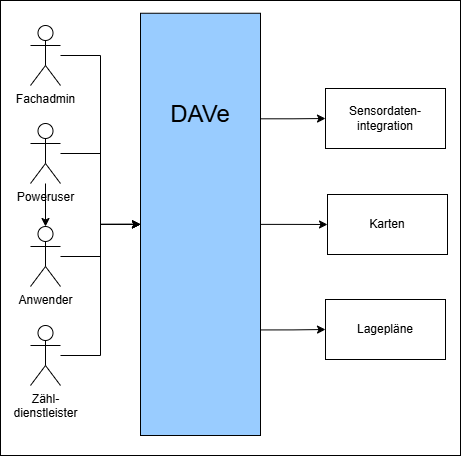

| Rolle bzw. <br/> angebundenes System | Beschreibung                                                                                        |
|:-------------------------------------|:----------------------------------------------------------------------------------------------------|
| Fachadmin                            | Beauftragt im Adminportal die Zählungen und verwaltet die bereits vorhandenne Zählungen / Messungen |
| Poweruser                            | Hat im Datenportal Leserechte auf alle freigegebenen Zählungen / Messungen                          |
| Anwender                             | Hat im Datenportal Leserechte auf alle freigegebenen Zählungen / Messungen außer Sonderzählungen    |
| Zähldienstleister                    | Führt die beauftragte Zählung durch und lädt die erhobenen Daten im Selfserviceportal hoch.         |
| Sensordatenintegration               | Schnittstelle zur Integration der Sensordaten                                                       |
| Karten                               | Verwendung eines GIS zum Abruf von Stadtkarten                                                      |
| Lagepläne                            | Schnittstelle zum Abrufen der Lagepläne der Messstellen                                             |

## Technischer Kontext

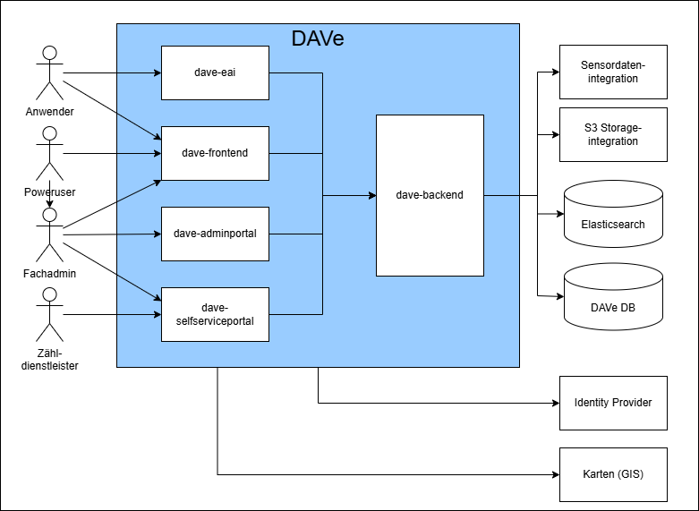

| Kontext                                                                                          | Hintergrund und/oder Motivation                                                                                                                                                                                 |
|:-------------------------------------------------------------------------------------------------|:----------------------------------------------------------------------------------------------------------------------------------------------------------------------------------------------------------------|
| Implementierung von Deploybaren Diensten in Java                                                 | Alle deploybaren Dienste der Anwendung sind in Java unter Verwendung des Spring-Frameworks zu implementieren. Die Schnittstelle (d.h. die API) müssen jedoch sprach- und frameworkunabhängig sein.              |
| Implementierung der GUI in JavaScript                                                            | Die an den Browser auszuliefernde GUI ist in JavaScript unter Verwendung von Typescript zu implementieren. Als JavaScript- Framework ist Vue.js (Version 3) und als Komponentenframework Vuetify zu verwenden.  |
| Software und Abhängigkeiten von Drittanbietern müssen über ein Build-Werkzeug installierbar sein | Der interessierte Entwickler oder Architekt muss in der Lage sein die Anwendung zu bauen und auszuführen, ohne Probleme beim Bauen zu haben. Alle Abhängigkeiten müssen über das Build-Werkzeug verfügbar sein. |
| Software von Drittanbietern muss unter einer kompatiblen Open-Source-Lizenz verfügbar sein.      | Die in der Anwendung implementierten und Open Source verfügbaren Dienste beitzen die MIT-Lizenz. Folglich müssen alle in den Diensten verwendeten Abhängigkeiten kompatibel mit der MIT-Lizenz sein.            |
| Softwarebereitstellung in einer Container-Plattform                                              | Alle in der Anwendung implementieren und deploybaren Dienste sind über die Container-Plattform bereitzustellen. Ein Rollout der Dienste findet über eine automatisierte Pipeline statt.                         |

# Bausteinsicht

## Whitebox Gesamtsystem

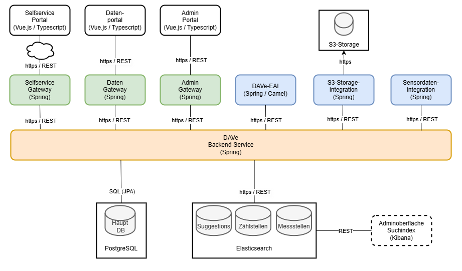

### Technologie Stack

| Plattform    | Version |
|:-------------|:--------|
| Java         | 21      |
| Spring-Boot  | 3       |
| Spring-Cloud | 3       |
| Postgre      | 16      |
| Elk-Stack    | 8       |
| Typescript   | 5       |
| Vue          | 3       |

### Anwendung DAVe
| Komponente        | Repo                             | Beschreibung                                                                                                                                                                                                                                         |
|:------------------|:---------------------------------|:-----------------------------------------------------------------------------------------------------------------------------------------------------------------------------------------------------------------------------------------------------|
| Datenportal       | [dave-frontend](https://github.com/it-at-m/dave-frontend)             | Das Datenportal bietet einen lesenden Zugriff auf die Zählungen und ermöglicht mit Hilfe verschiedener Diagramme eine umfangreich Datenanalyse.                                                                                                      |
| Adminportal       | [dave-adminportal](https://github.com/it-at-m/dave-admin-portal)          | Das Adminportal ist den Administratoren der Anwendung vorbehalten. Hier ist der komplette Workflow um eine Zählstelle, oder eine Zählung anzulegen abgebildet. Auch die Kommunikation mit dem Zähldienstleister wird über dieses Portal abgewickelt. |
| Selfserviceportal | [dave-selfserviceportal](https://github.com/it-at-m/dave-selfservice-portal)    | Das Selfservice-Portal dient zur Kommunikation zwischen LHM und Zähldienstleister. Über das Portal hat der Dienstleister die Möglichkeit, seine Zählungsaufträge online aufzurufen und diesen Aufträgen Zähldaten zuzuordnen (hochzuladen).          |
| Backend           | [dave-backend](https://github.com/it-at-m/dave-backend)              | Beinhaltet die Business Logik für Frontend, Adminportal, Selfserviceportal und EAI, sowie die Anbindung an die Datenbanken. Die Api kann über die eingebaute Swagger-UI eingesehen werden.                                                           |
| DAVe-EAI          | [dave-eai](https://github.com/it-at-m/dave-eai)                  | Die EAI dient dazu Daten zu den Zählstellen und Zählungen als CSV oder JSON-File zu exportieren.                                                                                                                                                     |

In jedem Frontend ist ein eigenes API Gateway enthalten, welches zur Autorisierung und Authentifizierung der
Anwender*innen und zur Bereitstellung der grafischen Oberfläche der Anwendung benötigt wird.


### DAVe EAI

Diese EAI dient dazu, Daten für andere Systeme aus DAVe zu exportieren. Das geschieht indem Daten direkt im CSV- oder JSON-Format ausgegeben werden.
Folgende Funktionen werden angeboten

#### Ausgabe aller Zählstellen mit Koordinaten als CSV-Datei

Aufgabe: Durchleiten des Requests an das Backend und Umwandlung der JSON-Response des Backends in CSV und Rückgabe der CSV an den Aufrufenden.

Routenendpunkt: ```GET /lade-auswertung-zaehlstellen-koordinate```

Routenziel: ```dave-backend GET /lade-auswertung-zaehlstellen-koordinate```

#### Ausgabe der Spitzenstunde einer bestimmten Zählung als CSV-Datei

Aufgabe: Durchleiten des Requests an das Backend und Umwandlung der JSON-Response des Backends in CSV und Rückgabe der CSV an den Aufrufenden.

Routenendpunkt: ```GET /lade-auswertung-spitzenstunde```

Routenziel: ```dave-backend GET /lade-auswertung-spitzenstunde```


#### Daten aller Zählstellen und Zählungen des angegebenen Monats werden im JSON-Format zurückgegeben

Aufgabe: Durchleiten des Requests an das Backend und Rückgabe der JSON-Response des Backends an den Aufrufenden.

Routenendpunkt: ```GET /lade-auswertung-visum```

Routenziel: ```dave-backend GET /lade-auswertung-visum```

### S3-Storageintegration

Die Schnittstellendefinition ist [hier](https://github.com/it-at-m/dave-backend/blob/main-ng/src/main/resources/api/document-storage.json) nachzulesen. 


### Sensordatenintegration

Da die EAI eine interne LHM-spezifische Schnittstelle benutzt und somit nicht von allgemeinem Interesse ist, wird das Artefakt nicht Opensource entwickelt.
Die EAI ruft aus einem anderen System die Sensordaten ab und bereitet diese auf. 
Dabei übernimmt die EAI auch Aggregationen von Messwerten (z.B. zur Bereitstellung von Gesamtauswertungen), um die Menge der zu transportierenden Daten zu reduzieren.

Die Schnittstellendefinition ist [hier](https://github.com/it-at-m/dave-backend/blob/main-ng/src/main/resources/api/geodateneai.json) nachzulesen. 

### Identity Provider

OAuth2 Schnittstelle zur Authentifizierung und Autorisierung von Anwender*innen. Das API
Gateway prüft, ob bei einem Aufruf der Anwendung in der Web-Session kein Access-Token
hinterlegt ist. Wenn nicht, leitet das API Gateway den Request an den Identity Provider weiter.
Der/die Anwender*in wird mittels SSO authentifiziert und ein Access Token in der Web-Session
hinterlegt. Der Access Token wird an alle Komponenten (Services) der Anwendung
mitgegeben. Diese prüfen beim Identity Provider, ob der Access Token gültig ist. Die Rechte
der Anwender*innen sind im Identity Provider hinterlegt, die Komponenten können diese dort
abfragen.

Ein beispielhafter JWT sieht so aus:
```json
{
  "header" : {
    "alg" : "RS256",
    "typ" : "JWT",
    "kid" : "..."
  },
  "payload" : {
    "exp" : 1759990697,
    "iat" : 1759990397,
    "auth_time" : 1759990397,
    "jti" : "...",
    "iss" : "...",
    "aud" : "account",
    "sub" : "...",
    "typ" : "Bearer",
    "azp" : "dave",
    "session_state" : "...",
    "realm_access" : {
      "roles" : [ "offline_access", "uma_authorization" ]
    },
    "resource_access" : {
      "dave" : {
        "roles" : [ "EXTERNAL", "POWERUSER", "FACHADMIN" ]
      },
      "account" : {
        "roles" : [ "manage-account", "manage-account-links", "view-profile" ]
      }
    },
    "scope" : "email profile",
    "sid" : "...",
    "email_verified" : false,
    "user_name" : "fachadmin",
    "name" : "Fach Admin",
    "preferred_username" : "fachadmin",
    "given_name" : "Fach",
    "family_name" : "Admin",
    "authorities" : [ "ROLE_POWERUSER", "ROLE_FACHADMIN", "ROLE_EXTERNAL" ]
  },
  "signature" : "..."
}
```


# Laufzeitsicht

## Download Messstellen-Lageplan

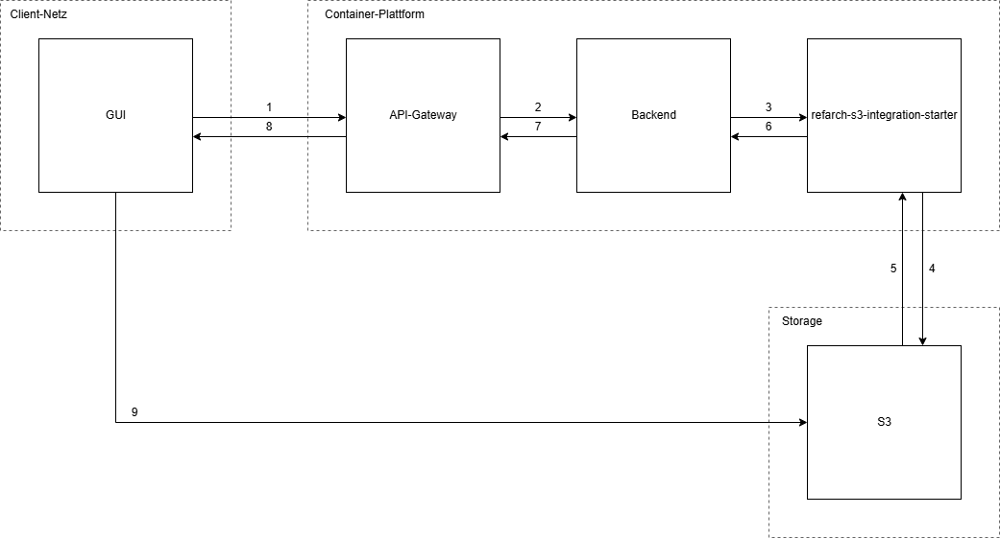

1. Request zur Erzeugung einer Presigned-URL von GUI im Browser an das API-Gateway.
   <br/>Payload: outerFolder/innerFolder/thefile.pdf
2. Request zur Erzeugung einer Presigned-URL von API-Gateway an das Backend.
   <br/>Payload: outerFolder/innerFolder/thefile.pdf
3. Request zur Erzeugung einer Presigned-URL von Backend an die refarch-s3-integration-starter.
   <br/>Payload: outerFolder/innerFolder/thefile.pdf
4. Request zur Erzeugung einer Presigned-URL von refarch-s3-integration-starter an den S3-Storage.
   <br/>Payload: outerFolder/innerFolder/thefile.pdf
5. Der S3-Storage antwortet der refarch-s3-integration-starter mit der Presigned-URL
   <br/>Payload: https://s3.service/The-Bucket/outerFolder/innerFolder/thefile.pdf?abc=abcdf4sfskhsdfsfddsghjve884545klnfgv  
6. Die refarch-s3-integration-starter antwortet dem Backend mit der Presigned-URL
   <br/>Payload: https://s3.service/The-Bucket/outerFolder/innerFolder/thefile.pdf?abc=abcdf4sfskhsdfsfddsghjve884545klnfgv  
7. Das Backend antwortet dem API-Gateway mit der Presigned-URL
   <br/>Payload: https://s3.service/The-Bucket/outerFolder/innerFolder/thefile.pdf?abc=abcdf4sfskhsdfsfddsghjve884545klnfgv  
8. Das API-Gateway antwortet der GUI im Browser mit der Presigned-URL
   <br/>Payload: https://s3.service/The-Bucket/outerFolder/innerFolder/thefile.pdf?abc=abcdf4sfskhsdfsfddsghjve884545klnfgv  
9. Die GUI im Browser führt den Request mit der Presigned-URL direkt an den S3-Storage aus.
   <br/>Payload: https://s3.service/The-Bucket/outerFolder/innerFolder/thefile.pdf?abc=abcdf4sfskhsdfsfddsghjve884545klnfgv

## Gesamtauswertung für Messstellen

Die Gesamtauswertung über mehrere Messstellen, Messquerschnitte, Zeiträume, Fahrzeugklassen und Fahrzeugkategorien 
liefert eine grafische Darstellung als Gangliniendiagramm sowie gleichzeitig die ausgewerteten Daten als Spreadsheetdatei.

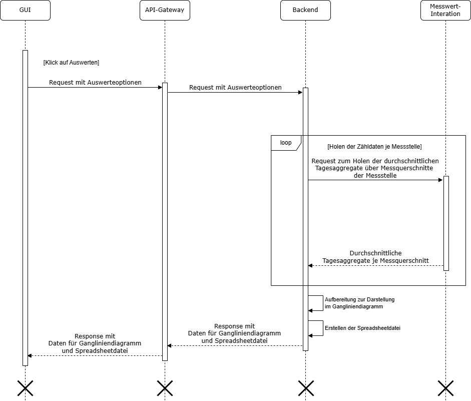

## Auswertung einer Messstelle

Die Auswertung liefert auf Basis der gewählten Optionen die aggregierten und gemittelten Intervalle 
einer Messstelle für einen gewählten Zeitraum und zeigt diese grafisch an.

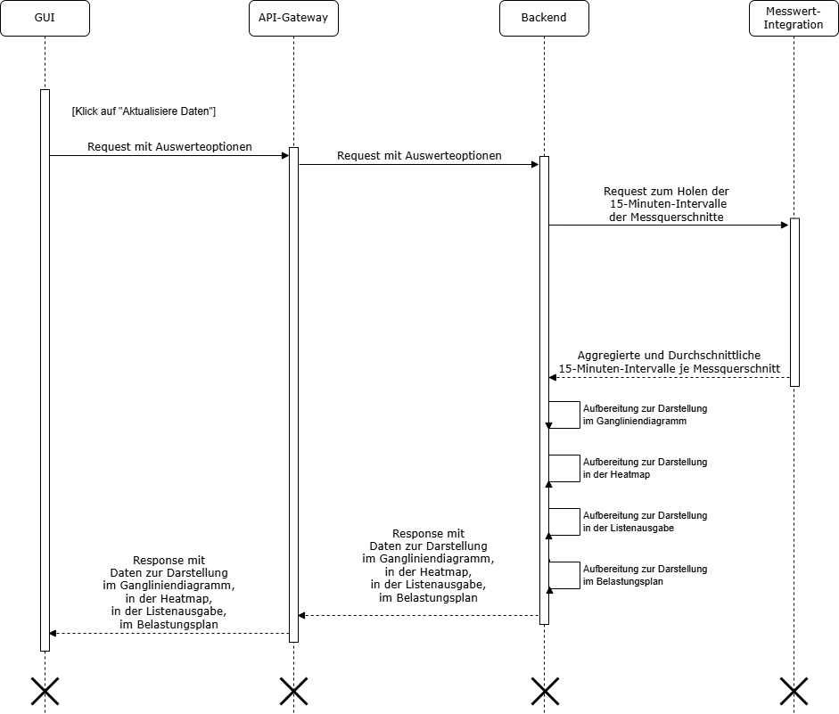

## Periodischer Cronjob zum Anlegen und Aktualisieren von Messstellen

Der periodische Lauf holt sich alle Messstellen über eine Integrationskomponente und prüft für jede Messstelle ob diese bereits existiert.
Handelt es sich um eine neue Messstelle, so wird diese angelegt. Existiert die Messstelle bereits in der Anwendung, werden die Messstellenattribute aktualisiert.
Bei einer Neuanlage wird eine Informationsmail versendet. Bei einer Aktualisierung der Messstellen findet ein Mailversand nur bei einer Statusänderung statt.

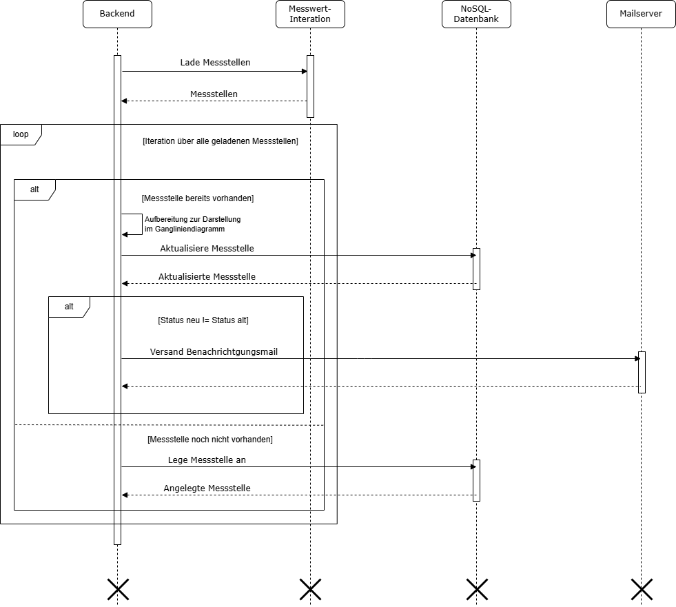

## Periodischer Cronjob zum Aktualisieren des Zählungsstatus bei beauftragten Zählungen

Der periodische Lauf prüft für alle beauftragten Zählungen, ob bereits das Datum der Zählung eingetreten ist.
Entspricht das aktuelle Datum dem Zähldatum, wird der Zählungsstatus auf den Wert Durchführung gesetzt und eine Benachrichtigung per Mail versendet.

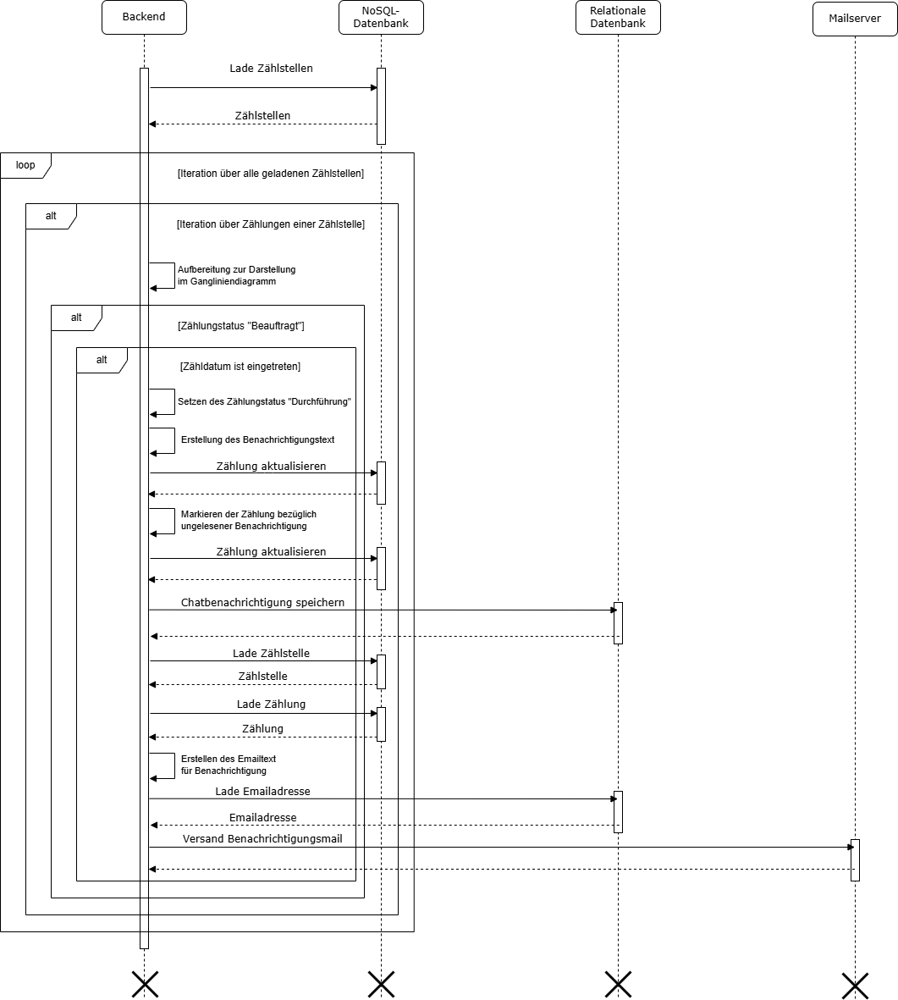

## Auswertung der Zählung einer Zählstelle

Die Auswertung liefert auf Basis der gewählten Optionen die aggregierten 15-, 30- oder 60-minütigen-Intervalle 
der Zählung einer Zählung für einen gewählten Zeitraum und zeigt diese grafisch an.

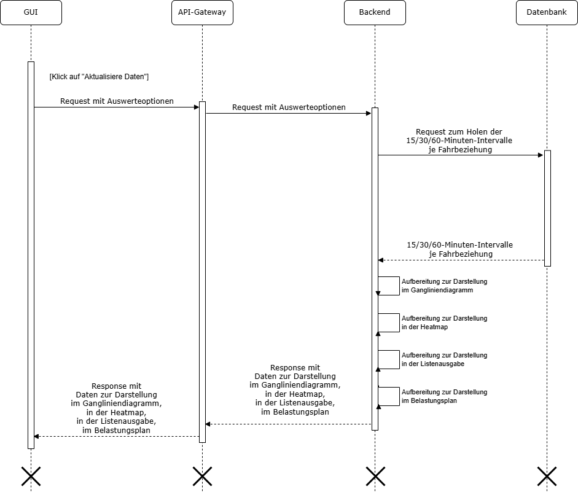

## Speichern der Zählung einer Zählstelle mit Zähldaten im Self-Service-Portal

Im Self-Service-Portal werden durch den Dienstleister für die Zählung CSV-Dateien 
mit den Zähldaten je Knotenarm hochgeladen und in der Anwendung persistiert.

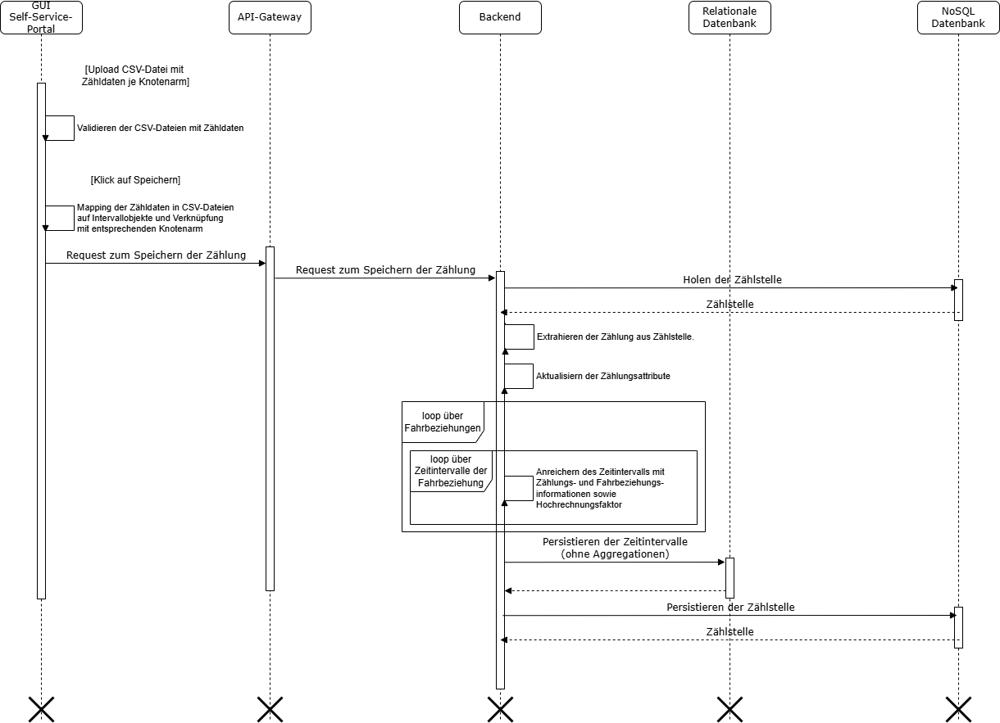

## Zählung einer Zählstelle erfolgreich durchgeführt

Die im Self-Service-Portal getriggerte Statusänderung auf `ACCOMPLISHED` aggregiert und summiert die bereits persistierten Intervalle.

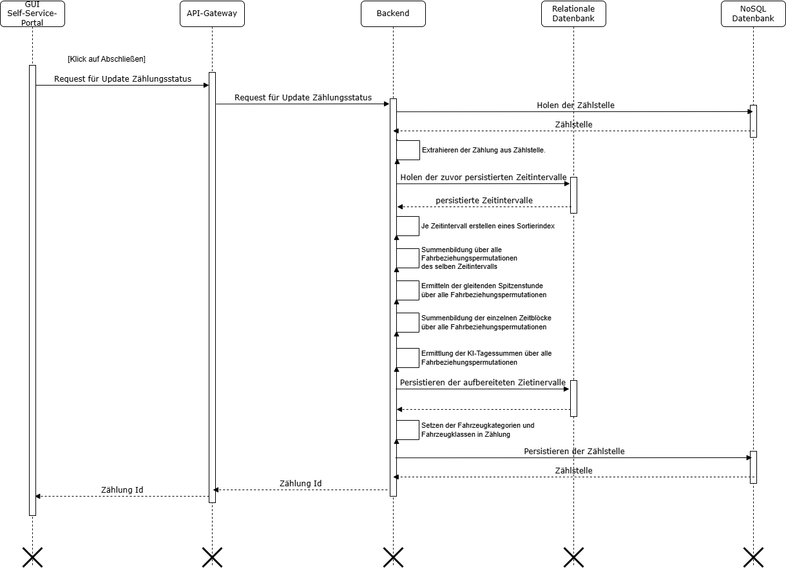

# Querschnittliche Konzepte

## Datenmodell

### Zahlstellen

Die in den Zählstellen abgebildeten Tageszählungen werden im nachfolgenden Datenmodell dargestellt.

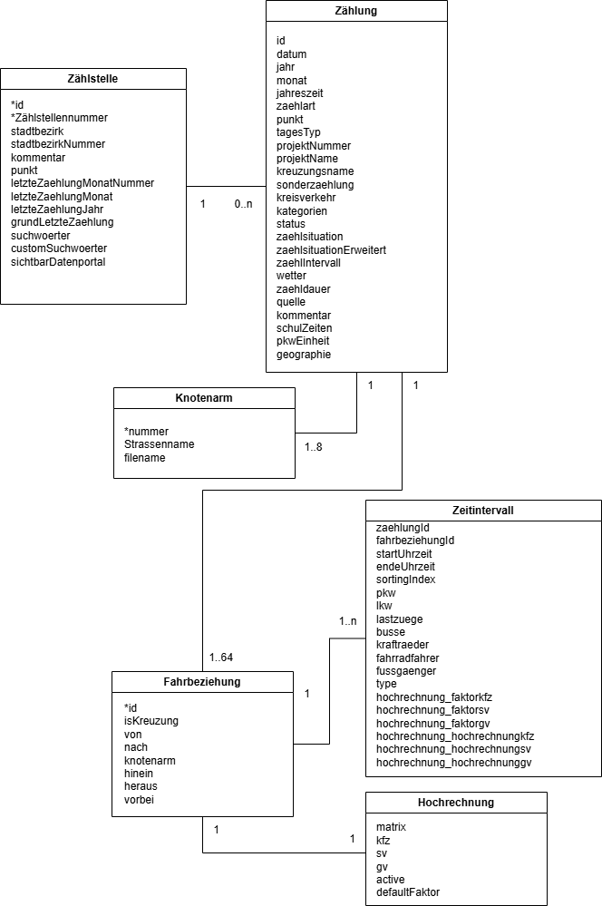

| Entität       | Beschreibung                                                                                                                                                                                        |
|---------------|-----------------------------------------------------------------------------------------------------------------------------------------------------------------------------------------------------|
| Zählstelle    | Die Zählstelle ist die Örtlichkeit in der die Zählungen durchgeführt werden.                                                                                                                        |
| Zählung       | Jede Zählung ist einer Zählstelle zugerordnet und wird dort durchgeführt.                                                                                                                           |
| Knotenarm     | Eine Zählung kann bis zu acht Knotenarme umfassen. Der Knotenarm repräsentiert die Straße die in die Zählstelle mündet.                                                                             |
| Fahrbeziehung | Eine Zählung kann je Knotenarm bis zu acht Fahrbeziehungen besitzen. Eine Fahrbeziehung beginnt bei einem Knotenarm und endet bei einem anderen Knotenarm oder bei sich selbst (U-Turn).            |
| Hochrechnung  | Jeder Fahrbeziehung sind die für die Hochrechnung erforderlichen Hochrechnungsfaktoren angegliedert. Die Faktoren sind erforderlich um die im Zeitintervall hochgerechneten Zählwerte zu ermitteln. |
| Zeitintervall | Hier handelt es sich um die Zählwerte die in einem Zeitintervall für eine Fahrbeziehung ermittelt wurden.                                                                                           |

## Messstellen

Bei den Dauermessstellen stellt sich das Datenmodell wie folgt.

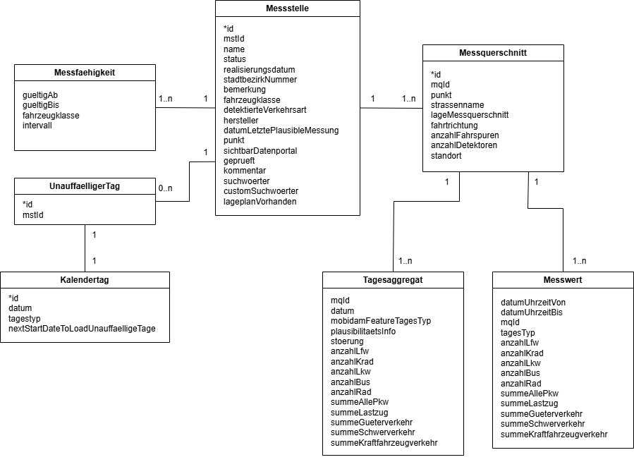

| Entität         | Beschreibung                                                                                                        |
|-----------------|---------------------------------------------------------------------------------------------------------------------|
| Messstelle      | Die Messstelle ist die Örtlichkeit in der die Dauermessungen des Verkehrs durchgeführt werden.                      |
| Messquerschnitt | Eine Messstelle besitzt mehrere Messquerschnitte an denen die automatisierten Verkehrsmessungen vorgenommen werden. |
| Messfähigkeit   | Die Messfähigkeit gibt an, in welchem Zeitraum welche Fahrzeugklassen in welchen Intervallen gemessen wurdem.       |
| UnaufälligerTag | Die Entität definiert an welchem Tag die Messstelle gültige Messwerte geliefert hat.                                |
| Kalendertag     | Hier wird das tatsächliche Tagesdatum für den unaufälligen Tag abgebildet.                                          |
| Messwert        | Hier werden die Messwerte eines Zeitintervalls abgebildet.                                                          |
| Tagesaggregat   | Die auf einen Kalendertag aggregierten Messwerte einer Dauermessstelle.                                             |

## Architekturpatterns

DAVe wird nach  der LHM-Referenzarchitektur entwickelt.
Zur Kommunikation untereinander verwenden die Dienste REST. Die REST-Endpunkte zu Integrationskomponenten sind teilweise gemäß dem OpenAPI-Standard spezifiziert, was bei DAVe den zusätzlichen Effekt hat, dass die Spezifikation als Input für Code-Generierung dient.

## Security

Die Anwendung wird über eine Nutzername-Passwort-Authentifizierung abgesichert. Die REST-Endpunkte für die Geschäftslogik werden durch eine Access-Token-Autorisierung abgesichert. Dies wird entsprechend OAuth 2.0 mit einem erforderlichen Identity Provider umgesetzt.

Nur ausgewählte Nutzer*innen sind in DAVe berechtigt Daten zu lesen oder zu schreiben. Diesen Personen werden im über den Identity Provider zu einer Rolle oder auch zu mehreren Rollen zugeordnet, welchen wiederum eine oder mehrere Rechte zugeordnet sind. Dadurch ist einerseits das Vergeben von Rechten relativ simpel und andererseits sind in DAVe selbst keine Zusammenhänge zwischen Rollen und Rechten fest verbaut. Die Anwendung fragt die Rolle und Rechte der/des aktuell angemeldeten Nutzerin/Nutzers an verschiedenen Stellen ab, um zu entscheiden, ob eine bestimmte Aktion zulässig ist.

## Validierung von Eingaben

Eingaben der Nutzer*innen werden sowohl im Frontend, als auch im Backend validiert. Die Frontendvalidierung dient dazu, eine möglichst unmittelbare Rückmeldung an die/den Nutzer*in sicherzustellen.
Da man aber Requests direkt ans Backend schicken könnte, ist diese Schicht der Validierung alleine nicht ausreichend, weshalb im Backend eine zusätzliche, vollständigere Validierung durchgeführt wird.

# Risiken und technische Schulden

## LCM - Alle REST-Endpunkt des Backends und der EAIs mittels Swagger gemäß OpenAPI-Standard spezifizieren

Durch die zusätzliche Bereitstellung einer OpenAPI-Spezifikation der REST-Schnittstellen entfällt die manuelle Erstellung von DTOs in den zu verwenden Diensten. 
Diese DTOs können durch die Verwendung des OpenAPI-Generators automatisch bei jedem Build generiert werden.

## LCM - Vorhalten der Messstellen und Zählstellen in relationaler Datenbank und ausschließliche Verwendung von Elasticsearch als Suchindex

Aktuell werden die Daten der Zählstellen, Zählungen und Messstellen mitsamt dem Suchindex in Elasticsearch vorgehalten.

Das Ziel des LCM ist, die Zählstellen, Zählungen und Messstellen in die relationale Datenbank zu migrieren und in Elasticsearch ausschließlich den Suchindex vorzuhalten.
Die Suche wird dann mittels [Hibernate Search](https://hibernate.org/search/documentation/) durchgeführt.

## LCM - Umbau Relation Zählung zu Fahrbeziehung und Zählung zu Knotenarm nach Zählung zu Knotenarm zu Fahrbeziehung

Aktuell referenziert die Zählung jeweils die Fahrbeziehungen und die Knotenarme jeweils in einem eigenen Attribut.

Fachlich sind jedoch die Fahrbeziehungen einen bestimmten Knotenarm zugeordnet. 
Die Knotenarme befinden sich wiederum an einer Zählung.
Diese fachlichen Abhängigkeiten sind somit auch im technischen Datenmodell durch entsprechende Migration abzubilden.

## LCM - Ersetzen der programmatischen API-Gateways für Daten-, Admin- und Selfserviceportal durch Refarch-Image des API-Gateways

Die GUIs des Daten-, Admin- und Selfserviceportals werden jeweils über ein eigenes API-Gateway bereitgestellt. 
Das heisst, die GUI befindet sich als Abhängigkeit im jeweiligen API-Gateway.

Das Ziel des LCM ist, ein zentrales API-Gateway bereitzustellen, welches als zentrales Gateway für die eingehenden Requests dient. 
Die GUIs werden über einen eigenen Dienst ausgeliefert, welcher hinter dem Gateway verschattet ist.

## LCM - Belastungsplan des Kreisverkehrs als SVG bereitstellen

Aktuell wird der Belastungsplan des Kreisverkehrs mittels Apache eCharts erzeugt.
Dies soll umgestellt werden auf SVG, analog zum Belastungsplan der Kreuzung.

## LCM - Validierung im Frontend und Backend angleichen

Die Validierung der Eingaben im Frontend, sollen sich auch im Backend wiederfinden.

## LCM - Nicht benötigte Restendpunkte entfernen

Im Fronted und Backend gibt es nicht verwendete Schnittstellen. Diese müssen entfernt werden.

## LCM - Nicht verwendete Attribute in den Entitäten entfernen

Es muss überprüft werden, ob in den Entitäten Attribute vorhanden sind, die nicht mehr benötigt werden.
Falls welche vorhanden sind, müssen diese entfernt werden.

